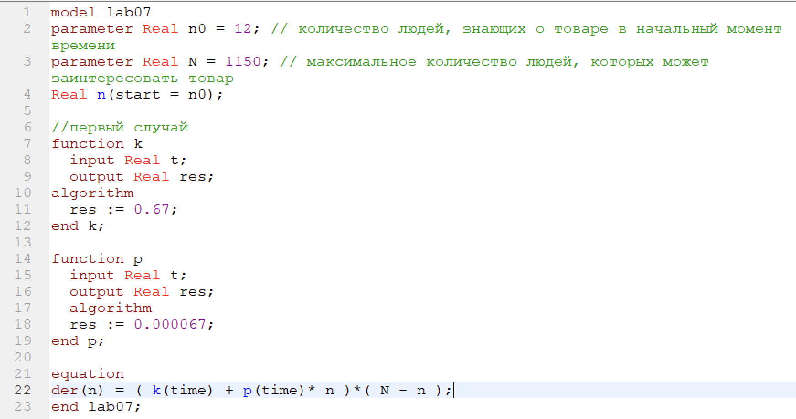
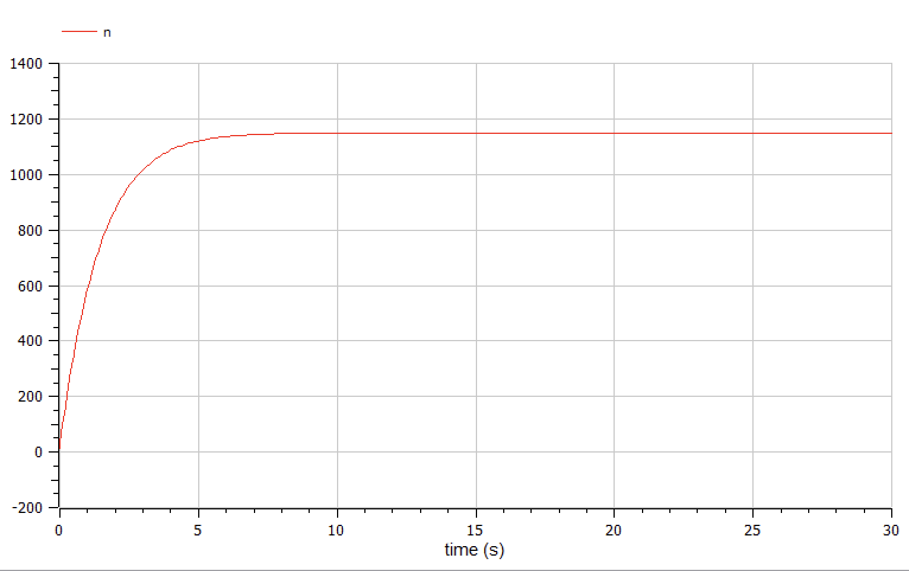
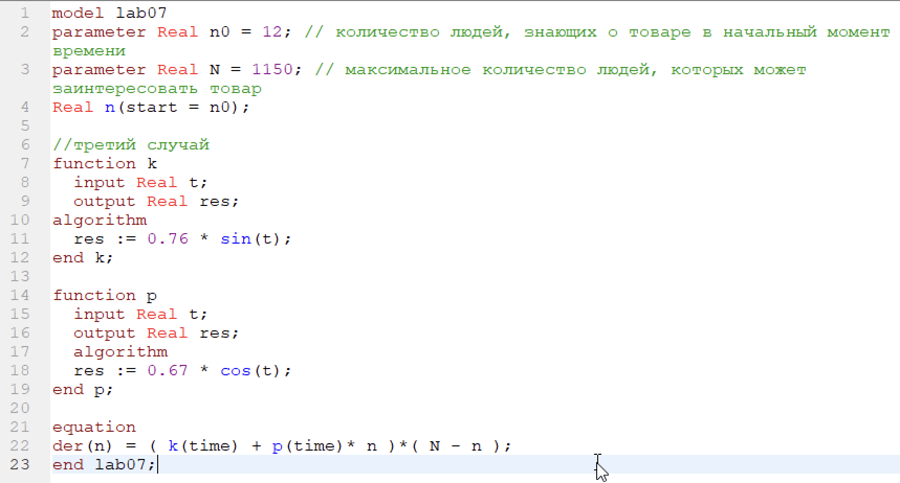
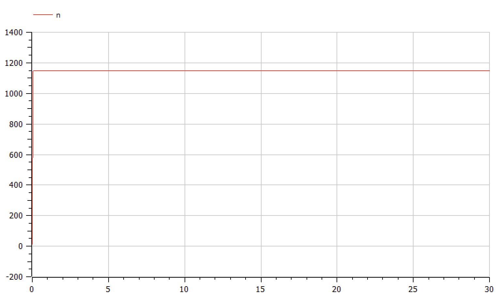

---
# Front matter
title: "Отчёт по лабораторной работе №7"  
subtitle: "Вариант 39"  
author: "Александр Олегович Воробьев"

# Generic otions
lang: ru-RU
toc-title: "Содержание"

# Pdf output format
toc: true # Table of contents
toc_depth: 2
lof: true # List of figures
lot: true # List of tables
fontsize: 12pt
linestretch: 1.5
papersize: a4
documentclass: scrreprt
## I18n
polyglossia-lang:
  name: russian
  options:
	- spelling=modern
	- babelshorthands=true
polyglossia-otherlangs:
  name: english
### Fonts
mainfont: PT Serif
romanfont: PT Serif
sansfont: PT Sans
monofont: PT Mono
mainfontoptions: Ligatures=TeX
romanfontoptions: Ligatures=TeX
sansfontoptions: Ligatures=TeX,Scale=MatchLowercase
monofontoptions: Scale=MatchLowercase,Scale=0.9
## Biblatex
biblatex: true
biblio-style: "gost-numeric"
biblatexoptions:
  - parentracker=true
  - backend=biber
  - hyperref=auto
  - language=auto
  - autolang=other*
  - citestyle=gost-numeric
## Misc options
indent: true
header-includes:
  - \linepenalty=10 # the penalty added to the badness of each line within a paragraph (no associated penalty node) Increasing the value makes tex try to have fewer lines in the paragraph.
  - \interlinepenalty=0 # value of the penalty (node) added after each line of a paragraph.
  - \hyphenpenalty=50 # the penalty for line breaking at an automatically inserted hyphen
  - \exhyphenpenalty=50 # the penalty for line breaking at an explicit hyphen
  - \binoppenalty=700 # the penalty for breaking a line at a binary operator
  - \relpenalty=500 # the penalty for breaking a line at a relation
  - \clubpenalty=150 # extra penalty for breaking after first line of a paragraph
  - \widowpenalty=150 # extra penalty for breaking before last line of a paragraph
  - \displaywidowpenalty=50 # extra penalty for breaking before last line before a display math
  - \brokenpenalty=100 # extra penalty for page breaking after a hyphenated line
  - \predisplaypenalty=10000 # penalty for breaking before a display
  - \postdisplaypenalty=0 # penalty for breaking after a display
  - \floatingpenalty = 20000 # penalty for splitting an insertion (can only be split footnote in standard LaTeX)
  - \raggedbottom # or \flushbottom
  - \usepackage{float} # keep figures where there are in the text
  - \floatplacement{figure}{H} # keep figures where there are in the text
---

# Цель работы  

  Изучить модель эффективности рекламы, построить графики моделей для трёх случаев с разными значениями для $\alpha_1$ и $\alpha_2$.  

# Задание  

  Построить график распространения рекламы, математическая модель которой описывается следующим уравнением:  
  1. $\frac{dn}{dt} = (0.67 + 0.000067n(t))(N - n(t))$  
  2. $\frac{dn}{dt} = (0.000076 + 0.76n(t))(N - n(t))$  
  3. $\frac{dn}{dt} = (0.76\sin(t) + 0.67\cos(t)n(t))(N - n(t))$  

  При этом объем аудитории N = 1150, в начальный момент о товаре знает 12 человек. Для случая 2 определить в какой момент времени скорость распространения рекламы будет иметь максимальное значение.

# Теоретическое введение  

  Организуется рекламная кампания нового товара или услуги. Необходимо, чтобы прибыль будущих продаж с избытком покрывала издержки на рекламу. Вначале расходы могут превышать прибыль, поскольку лишь малая часть потенциальных покупателей будет информирована о новинке. Затем, при увеличении числа продаж, возрастает и прибыль, и, наконец, наступит момент, когда рынок насытиться, и рекламировать товар станет бесполезным.  
  Предположим, что торговыми учреждениями реализуется некоторая продукция, о которой в момент времени t из числа потенциальных покупателей N знает лишь n покупателей. Для ускорения сбыта продукции запускается реклама по радио, телевидению и других средств массовой информации. После запуска рекламной кампании информация о продукции начнет распространяться среди потенциальных покупателей путем общения друг с другом. Таким образом, после запуска рекламных объявлений скорость изменения числа знающих о продукции людей пропорциональна как числу знающих о товаре покупателей, так и числу покупателей о нем не знающих.  
  Модель рекламной кампании описывается следующими величинами.
  Считаем, что $\frac{dn}{dt}$ - скорость изменения со временем числа потребителей, узнавших о товаре и готовых его купить, $t$ - время, прошедшее с начала рекламной кампании, $n(t)$ - число уже информированных клиентов. Эта величина пропорциональна числу покупателей, еще не знающих о нем, это описывается следующим образом: $\alpha_1(t)(N - n(t))$ , где $N$ - общее число потенциальных платежеспособных покупателей, $\alpha(t) > 0$ - характеризует интенсивность рекламной кампании (зависит от затрат на рекламу в данный момент времени). Помимо этого, узнавшие о товаре потребители также распространяют полученную информацию среди потенциальных покупателей, не знающих о нем (в этом случае работает т.н. сарафанное радио). Этот вклад в рекламу описывается величиной $\alpha_2(t)n(t)(N - n(t)$, эта величина увеличивается с увеличением потребителей узнавших о товаре. Математическая модель распространения рекламы описывается уравнением: $\frac{dn}{dt} = (\alpha_1(t) + \alpha_2(t) n(t))(N - n(t)))$  
  При $\alpha_1(t) >> \alpha_2(t)$ получается модель типа модели Мальтуса.
  В обратном случае, при $\alpha_1(t) << \alpha_2 (t)$ получаем уравнение логистической кривой.

# Выполнение лабораторной работы

**1. Пропишем программу для построения графика первой модели.** 

  Зададим исходные переменные и пропишем уровнение:

  { #fig:001 width=70% }  

  Запускаем модель для времени $0 < t < 30$, с шагом 0,1:

  { #fig:002 width=70% }  

  { #fig:003 width=70% }   

**2. Изменим программу для второго случая, заменив значения переменных $\alpha_1$ и $\alpha_2$.**  

	Изменим переменные:  

  { #fig:004 width=70% }  

	Запускаем модель для второго случая с теми же установками симуляции:  
    
  { #fig:005 width=70% }  
 
**3. Изменим программу для третьего случая, заменив значения переменных $\alpha_1$ и $\alpha_2$.**  

	Изменим переменные:  

  { #fig:006 width=70% }  

	Запускаем модель для третьего случая с теми же установками симуляции:  
    
  { #fig:007 width=70% }  

# Выводы

В ходе выполнения лабораторной работы я познакомился с моделями эффективности рекламы, релизовал графики для нескольких случаев с разными коэффициентами для интенсивности рекламной кампании и сарафанного радио.

# Список литературы{.unnumbered}

	1. Кулябов Д.С. Лабораторная работа №7. Эффективность рекламы [Электронный ресурс] - 5 с. 
	2. Кулябов Д.С. Лабораторная работа №7. Варианты [Электронный ресурс] - 26 с. 

::: {#refs}
:::
